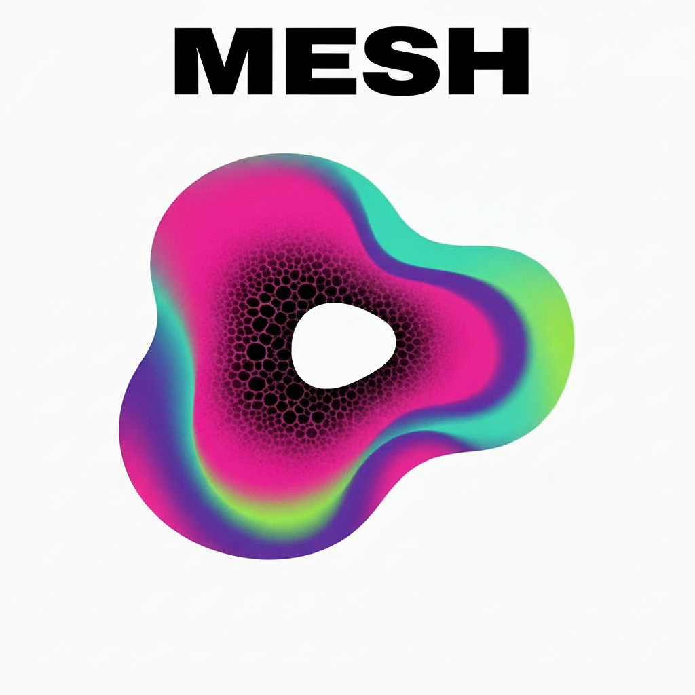

<p align="center">
  
</p>

<h3 align="center">Open-source stem-based DJ software for electronic music</h3>

<p align="center">
  Control individual elements — vocals, drums, bass, instruments — independently.<br>
  Built-in AI stem separation, ML-powered analysis, and smart track suggestions.
</p>

<p align="center">
  <a href="LICENSE"></a>
  <a href="#installation"></a>
  <a href="#installation"></a>
  <a href="#roadmap"></a>
</p>

---

<!-- TODO: Hero screenshot — mesh-player with 4 decks loaded, stem waveforms visible, mixer and browser overlay -->

## What is Mesh?

Mesh is a DJ software suite for mixing electronic music by stems. Import any audio file and Mesh separates it into four stems (vocals, drums, bass, other) using the [Demucs](https://github.com/facebookresearch/demucs) neural network. Then mix, apply effects, and perform — with independent control over each element.

Automatic beat sync and loudness matching make it approachable for beginners, while deep per-stem effect routing and plugin hosting satisfy experienced DJs looking to go beyond what commercial software offers.

| Application | Purpose |
|-------------|---------|
| **mesh-cue** | Prepare your library — import, separate stems, analyze BPM/key, edit beat grids, manage playlists, export to USB |
| **mesh-player** | Perform live — 4-deck stem mixing, per-stem effects, beat sync, MIDI controllers, smart suggestions, set recording |

Mesh is designed for **electronic music with regular beat grids** — techno, house, DnB, trance, and similar genres. The automatic beat sync and grid analysis assume consistent tempo. Genres with irregular timing (live recordings, jazz, hip-hop with swing) will need more manual grid work.

---

## What Makes Mesh Different

Most DJ software treats stems as an afterthought — mute or solo, maybe a basic filter. Mesh builds the entire workflow around stems, from preparation to performance.

<!-- TODO: GIF — muting/unmuting individual stems during a live mix, showing the waveform change -->

**Per-stem effect chains** — Route each stem through its own multiband effect chain with up to 8 frequency bands and 8 effects per band. Reverb on vocals, compression on drums, filter sweeps on bass — simultaneously. 4 macro knobs per deck map parameters across stems for one-knob control of complex transformations. Rekordbox, Serato, and Traktor offer basic stem filtering; mesh gives you full effect routing.

**CLAP plugin hosting** — Load professional studio plugins ([LSP](https://lsp-plug.in/), [Dragonfly Reverb](https://michaelwillis.github.io/dragonfly-reverb/), [Airwindows](https://www.airwindows.com/)) as stem effects. No other DJ software hosts CLAP plugins.

**Pure Data custom effects** — Write visual audio patches that run as live stem effects with up to 8 mapped parameters. Includes support for [RAVE](https://github.com/acids-ircam/RAVE) neural audio synthesis via the nn~ external.

**ML-powered library** — During import, neural networks classify genre (400 Discogs categories), detect vocal presence (96% accuracy), and extract audio fingerprints for similarity search. Beat detection uses the [Beat This!](https://github.com/CPJKU/beat_this) model (ISMIR 2024) — eliminates half-tempo errors common with DnB and fast tempos.

**Smart track suggestions** — Recommendations based on audio fingerprint similarity, harmonic compatibility, BPM proximity, and perceptual arousal. An energy direction fader steers suggestions toward higher or lower energy. Two key matching algorithms: classic Camelot wheel or [Krumhansl](https://en.wikipedia.org/wiki/Carol_L._Krumhansl) perceptual model. All processing is local — no cloud, no subscription.

**Stem linking** — Prepare mashups by linking stems across tracks. Vocals from track A over instrumentals of track B, pre-aligned and time-stretched. Links persist in your library for instant recall during performance.

**$112 embedded standalone** — Run the full player on an [Orange Pi 5 Pro](http://www.orangepi.org/html/hardWare/computerAndMicrocontrollers/details/Orange-Pi-5-Pro.html) with an I2S DAC. Boot directly into a kiosk DJ interface — no laptop, no subscription, no vendor lock-in.

<details>
<summary><strong>Feature comparison with other DJ software</strong></summary>

<br>

| Feature | Mesh | Rekordbox | Serato | Traktor | Mixxx |
|---------|:----:|:---------:|:------:|:-------:|:-----:|
| Stem separation | Built-in (Demucs) | Built-in | Built-in | Built-in (iZotope) | In development |
| Per-stem effect chains | Yes | No | No | No | No |
| CLAP plugin hosting | Yes | No | No | No | No |
| Custom PD effects | Yes | No | No | No | No |
| Neural audio effects (RAVE) | Yes | No | No | No | No |
| ML genre/mood tagging | Yes | No | No | No | No |
| Audio fingerprint suggestions | Yes | No | No | No | No |
| Perceptual key matching | Yes | No | No | No | No |
| Stem slicer | Yes | No | No | No | No |
| Embedded standalone | Yes (~$112) | No | No | No | Community |
| Vertical waveform layout | Yes | No | No | No | No |
| Streaming services | No | Yes | Yes | Yes | No |
| DVS / vinyl control | No | Yes | Yes | Yes | Yes |
| Sampler / remix decks | No | Yes | Yes | Yes | Yes |
| Video mixing | No | Add-on | Add-on | No | No |
| Auto DJ | No | No | No | No | Yes |
| macOS | Planned | Yes | Yes | Yes | Yes |
| Price | Free (AGPL) | Subscription | Subscription | One-time | Free (GPL) |

Mesh prioritizes **depth of stem control and audio intelligence** over breadth of DJ formats. If you need vinyl control, streaming services, or video mixing, Rekordbox/Serato/Traktor are better choices. If you want to push what's possible with stems, effects, and AI-assisted mixing — mesh is built for that.

</details>

<!-- TODO: Screenshot gallery — 2x2 grid: mesh-player horizontal layout, mesh-player vertical layout, mesh-cue track editing, multiband effect editor -->

---

## Installation

### Release Packages

| Package | Platform | Description |
|---------|----------|-------------|
| `mesh-cue_amd64.deb` | Linux (Ubuntu 22.04+) | Full suite with stem separation (CPU) |
| `mesh-cue-cuda_amd64.deb` | Linux (Ubuntu 22.04+) | Full suite with NVIDIA CUDA GPU acceleration |
| `mesh-cue_win.zip` | Windows 10/11 | Full suite with DirectML GPU acceleration |
| `mesh-player_amd64.deb` | Linux (Ubuntu 22.04+) | Lightweight performance player |
| `mesh-player_win.zip` | Windows 10/11 | Lightweight performance player |

Download from [GitHub Releases](https://github.com/dataO1/Mesh/releases).

### Linux

```bash
# Full suite (CPU stem separation)
sudo dpkg -i mesh-cue_amd64.deb

# Or with NVIDIA GPU acceleration
sudo dpkg -i mesh-cue-cuda_amd64.deb

# Performance player only
sudo dpkg -i mesh-player_amd64.deb
```

**Requirements:** PipeWire or JACK audio server. For CUDA: NVIDIA driver 525+ with CUDA 12.

### Windows

Extract the ZIP and run `mesh-cue.exe` or `mesh-player.exe`. A DirectX 12 capable GPU is recommended for faster stem separation but not required — it falls back to CPU automatically.

---

## Quick Start

### 1. Import Your Music

Launch **mesh-cue** and place audio files (MP3, FLAC, WAV, OGG, M4A) in `~/Music/mesh-collection/import/`.

<!-- TODO: GIF — importing tracks in mesh-cue, showing stem separation progress and analysis results -->

**Pre-separated stems:** Name files as `Artist - Track_(Vocals).wav`, `_(Drums).wav`, `_(Bass).wav`, `_(Other).wav` and select **Stems** import mode.

**Regular audio files:** Select **Mixed Audio** mode. Mesh separates each file into 4 stems automatically (2-5 min/track on CPU, 15-30 sec with GPU).

During import, mesh also analyzes BPM, musical key, loudness (LUFS), audio fingerprints, and optionally classifies genre and mood using neural networks.

### 2. Prepare Your Tracks

Load a track in mesh-cue to:

- Verify and adjust BPM detection
- Fine-tune beat grid alignment (nudge or align to playhead)
- Set up to 8 color-coded hot cues at key moments
- Save loops for performance recall
- Optionally link stems from other tracks for mashups

<!-- TODO: GIF — editing a beat grid in mesh-cue, nudging and aligning to a downbeat -->

### 3. Export to USB

Click **Export** to sync playlists to a USB drive. Select which playlists to include, and mesh copies the stems, metadata, and presets. The USB works with mesh-player on any machine or embedded device.

### 4. Perform

Launch **mesh-player**, browse your collection, and load tracks onto the 4 decks.

<!-- TODO: GIF — loading a track, engaging beat sync, muting stems during a transition -->

| Control | Function |
|---------|----------|
| Play / Cue | CDJ-style transport with cue point preview |
| Stem buttons | Mute/solo individual stems per deck |
| Beat sync | Automatic beat grid alignment to global BPM |
| Key match | Automatic harmonic pitch adjustment |
| Loop | Quantized loops from 1/8 beat to 256 beats |
| Hot cues | 8 instant-jump points per track |
| Slicer | Real-time stem slice resequencing |
| Suggestions | AI track recommendations with energy direction control |

---

## Features

<details>
<summary><strong>Track Preparation (mesh-cue)</strong></summary>

<br>

- **AI stem separation** — Import regular audio files and automatically separate into Vocals, Drums, Bass, and Other using Demucs. Standard or fine-tuned models, 1-5 processing shifts for quality vs speed. GPU acceleration via CUDA (Linux) or DirectML (Windows)
- **BPM detection** — Two backends: Simple (Essentia RhythmExtractor) for speed, or Advanced ([Beat This!](https://github.com/CPJKU/beat_this) ONNX model) for accuracy. Advanced mode includes downbeat detection and eliminates half-tempo errors on DnB and fast tempos
- **Key detection** — Automatic musical key identification via Essentia
- **Beat grid editing** — Nudge grid in ~2.5ms increments, align to playhead position, adjust BPM. Grid updates instantly on the waveform
- **8 hot cues per track** — Color-coded, beat-snapped, CDJ-style jump points
- **8 saved loops per track** — Store and recall loop regions with variable length
- **Stem linking** — Link a stem from another track for prepared mashups with automatic time-alignment and BPM stretching. Drop markers for alignment reference
- **ML audio analysis** — Genre classification (400 Discogs categories), vocal/instrumental detection (96% accuracy), mood and arousal estimation, audio characteristics (timbre, tonality, danceability). All on-device using EffNet neural networks
- **Batch re-analysis** — Re-analyze metadata, BPM, or ML tags for selected tracks, playlists, or the entire collection
- **Playlist management** — Create, organize, and nest playlists with drag-and-drop between dual browser panels
- **USB export** — Sync playlists to USB drives with stems, metadata, and presets. Per-track progress, ETA, and cancellation support

<!-- TODO: Screenshot — mesh-cue with a track loaded, showing beat grid lines, cue points, and stem waveforms -->

</details>

<details>
<summary><strong>Live Performance (mesh-player)</strong></summary>

<br>

- **4-deck architecture** — Load and mix up to 4 tracks simultaneously, each with 4 independent stems
- **Per-stem control** — Mute, solo, and adjust volume for each stem independently
- **Automatic beat sync** — Tracks phase-lock to the global BPM on play. Configurable phase sync on/off
- **Automatic key matching** — Pitch-shift tracks to match harmonically
- **Stem slicer** — 8 slice pads per stem for real-time pattern resequencing with 8 storable presets per track
- **Quantized loops** — 1/8 beat to 256 beats with halve/double from encoder. Beat jump forward/backward by loop length
- **8 hot cues** — Instant jump points, color-coded, beat-snapped
- **Waveform layouts** — Horizontal (default) or Vertical (time flows top-to-bottom). Three abstraction levels (Low / Medium / High) control visual detail
- **Set recording** — Record master output to WAV on all connected USB sticks simultaneously. Automatic tracklist TXT file generated from session history with timestamps
- **Auto-gain** — LUFS-based loudness normalization with configurable target: -6 (loud), -9 (medium), -14 (streaming), -16 (broadcast)
- **Collection browser** — Search, sort, and browse playlists. Load tracks to specific decks. USB hot-plug detection. Played tracks dimmed
- **3-band EQ + filter** — Per-deck low/mid/high EQ and sweepable DJ filter (HP/LP combo, 60 Hz - 20 kHz)
- **Mixer** — Per-channel volume, cue enable, master volume, cue volume, cue/master mix

<!-- TODO: Screenshot — mesh-player with all 4 decks active, showing stem mute buttons and waveforms -->

</details>

<details>
<summary><strong>Effects System</strong></summary>

<br>

- **Multiband effect container** — Split each stem into up to 8 frequency bands with Linkwitz-Riley crossovers. Each band has its own effect chain (up to 8 effects per band)
- **4 macro knobs per deck** — Map parameters across multiple stems and effects for one-knob control of complex transformations
- **CLAP plugin hosting** — Load any CLAP audio plugin as a stem effect. Plugin discovery from `~/.clap/` and `/usr/lib/clap/`. Tested with LSP, Dragonfly Reverb, Airwindows, BYOD, ChowTapeModel
- **Pure Data effects** — Custom PD patches with up to 8 mapped parameters per effect. RAVE neural audio synthesis supported via nn~ external
- **Built-in effects** — Sweepable DJ filter (HP/LP), delay (with feedback), reverb, gain
- **Automatic latency compensation** — Delay-line alignment across stems, bands, and effect chains. Dynamic re-compensation when plugins change latency
- **Deck presets** — Save and recall complete effect configurations across all 4 stems. Reference stem presets by name for reuse

See [docs/effects.md](docs/effects.md) for details on creating PD patches, CLAP plugin setup, and preset management.

<!-- TODO: Screenshot — multiband effect editor with CLAP effects loaded on multiple bands, macro knobs visible -->

</details>

<details>
<summary><strong>Smart Suggestions</strong></summary>

<br>

Toggle suggestions in the collection browser to get track recommendations based on what's currently playing.

**Scoring factors:**
- Audio fingerprint similarity (HNSW vector search on 16-dimensional audio features)
- Harmonic key compatibility (Camelot wheel or Krumhansl perceptual model)
- BPM proximity
- Energy direction alignment (arousal, danceability, genre-normalized aggression)

**Energy direction fader** — Steer suggestions toward higher-energy or cooler tracks. At center, audio similarity dominates for safe harmonic matches. At extremes, energy-aware scoring takes over with relaxed harmonic filtering, rewarding bolder key transitions.

**Key scoring models** (selectable in Settings):
- **Camelot** — Classic DJ wheel with hand-tuned transition scores
- **Krumhansl** — 24x24 perceptual key distance matrix from music psychology research. More nuanced with cross-mode transitions (e.g., C major to C minor)

**Reason tags** — Each suggestion shows a colored pill (green/amber/red) with a directional arrow indicating the harmonic relationship and match quality.

See [docs/smart-suggestions.md](docs/smart-suggestions.md) for the full scoring pipeline, all transition types, and parameter reference.

</details>

<details>
<summary><strong>Audio Quality</strong></summary>

<br>

- **Zero-dropout loading** — Load new tracks while playing without audio glitches. Lock-free architecture with cyclic buffer pool
- **Professional time stretching** — [signalsmith-stretch](https://signalsmith-audio.co.uk/code/stretch/) for tempo changes without pitch artifacts
- **Master bus protection** — Soft limiter + hard clipper prevent distortion and protect speakers
- **Low-latency audio** — JACK on Linux (with PipeWire bridge), WASAPI on Windows. Typical output latency: 5-12ms
- **Separate master and cue outputs** — Route headphones to a different audio interface or channel pair for monitoring
- **Latency-compensated beat sync** — Real output pipeline latency is measured from hardware timestamps and used to compensate beat-snap decisions
- **Direct MIDI path** — Timing-critical commands (play, cue, hot cue, beat jump) bypass the UI tick loop and go directly to the audio engine via a lock-free ring buffer

</details>

---

## Documentation

Detailed guides for each area of mesh:

| Guide | Covers |
|-------|--------|
| **[Collection & Import](docs/collection.md)** | Folder structure, import workflows, USB export/sync, database, set recordings |
| **[MIDI Controllers](docs/midi-controllers.md)** | Learn wizard, deck layers, LED feedback, shift modes, compact 4-deck mapping |
| **[Effects System](docs/effects.md)** | Multiband container, CLAP plugins, Pure Data patches, RAVE neural effects, presets |
| **[Smart Suggestions](docs/smart-suggestions.md)** | Scoring pipeline, energy fader, key matching, transition types, reason tags |
| **[Configuration](docs/configuration.md)** | All settings (player & cue), themes, audio device setup, CLI arguments |
| **[Embedded Standalone](docs/embedded.md)** | Orange Pi hardware, DAC wiring, SD image, WiFi, OTA updates, troubleshooting |

---

## MIDI Controllers

Mesh works with any class-compliant MIDI controller. The **MIDI Learn** wizard walks you through mapping all controls — transport, stems, mixer, browser, effects, and performance pads.

<!-- TODO: GIF — MIDI learn wizard mapping a control, showing visual highlighting -->

| Device | Protocol | Features |
|--------|----------|----------|
| Allen & Heath Xone K2/K3 | MIDI | Rotary encoders, buttons, note-offset RGB LEDs with beat-synced pulsing |
| Native Instruments Kontrol F1 | HID | 4x4 RGB pad grid, encoders, faders, full-color LED feedback |
| Pioneer DDJ-SB2 | MIDI | Profile included |
| Any MIDI controller | MIDI | Via Learn wizard |

**Layer toggle** — Map 4 virtual decks to 2 physical controller sides with a single layer switch button.

**Compact mode** — Momentary mode overlays let you hold a button to temporarily switch pads to Hot Cue or Slicer mode, then release to return to default stem controls.

See [docs/midi-controllers.md](docs/midi-controllers.md) for the learn wizard guide, LED feedback details, and configuration reference.

---

## Embedded Standalone

Run mesh-player on an **Orange Pi 5 Pro** (~$80) as a standalone DJ unit — no laptop required.

| Component | Role | Approx. Cost |
|-----------|------|:------------:|
| Orange Pi 5 Pro 8GB | RK3588S SoC, WiFi 5, USB 3.0 | ~$80 |
| PCM5102A I2S DAC board | Master audio output (112 dB SNR) | ~$5 |
| ES8388 onboard codec | Headphone cue output (3.5mm) | Included |
| microSD card (32GB+) | NixOS system image | ~$8 |
| Enclosure + cables | Optional | ~$19 |
| | **Total** | **~$112** |

<!-- TODO: Photo — Orange Pi 5 with DAC wired, running mesh-player on a touchscreen -->

The device boots directly into mesh-player in fullscreen kiosk mode (NixOS + cage Wayland compositor). Load tracks from USB 3.0 sticks. Over-the-air updates via WiFi.

**Quick start:**

1. Download the SD image from [GitHub Releases](https://github.com/dataO1/Mesh/releases) (look for `sdimage-*` tags)
2. Flash: `zstdcat nixos-sd-image-*.img.zst | sudo dd of=/dev/sdX bs=4M status=progress`
3. Boot — mesh-player starts automatically

See [docs/embedded.md](docs/embedded.md) for the full hardware guide with wiring diagrams, device tree configuration, audio routing, WiFi/network setup, and OTA deployment.

---

## Configuration

Mesh stores its collection and configuration in `~/Music/mesh-collection/`:

```
mesh-collection/
├── import/          # Drop files here for import
├── tracks/          # Stem library (8-channel FLAC)
├── playlists/       # Playlist folders
├── presets/         # Effect presets (stems/ and decks/)
├── effects/         # Pure Data effect patches
├── config.yaml      # Application settings
└── theme.yaml       # Color theme
```

**Themes** — 5 built-in color themes (Mesh, Catppuccin, Rose Pine, Synthwave, Gruvbox) with customizable stem colors and UI accents. Themes switch instantly without restart.

**Fonts** — Exo (default), Hack, JetBrains Mono, Press Start 2P. Font and size changes require restart.

See [docs/collection.md](docs/collection.md) for details on import workflows, USB export, database, and set recordings. See [docs/configuration.md](docs/configuration.md) for the complete settings reference, theme customization, and audio device setup.

---

## Roadmap

Features in development or planned:

- [ ] macOS support
- [ ] Tag editing UI (add/edit/remove tags from the browser)
- [ ] Auto headphones cue (volume-based automatic cue routing)
- [ ] Live peak meters (per-channel and master)
- [ ] Built-in native effects (beat-synced echo, flanger, phaser, gater)
- [ ] Database versioning (schema migration for USB forward-compatibility)
- [ ] Session history browser and set reconstruction
- [ ] Slicer morph knob (scroll through preset banks)
- [ ] Jog wheel beat nudging
- [ ] B2B networked mode (dual-system Ethernet link)

---

## Building from Source

```bash
git clone https://github.com/dataO1/Mesh.git
cd Mesh
nix develop   # Enter dev environment with all dependencies

cargo build --release -p mesh-player
cargo build --release -p mesh-cue
```

**Requirements:** [Nix](https://nixos.org/) package manager — handles all native dependencies (Essentia, FFmpeg, JACK, Vulkan, hidapi, etc.).

See [ARCHITECTURE.md](ARCHITECTURE.md) for technical documentation on the audio engine, real-time architecture, and crate structure.

---

## Issues & Feedback

Mesh is not accepting code contributions at this time. If you find a bug or have a feature request, please [open an issue](https://github.com/dataO1/Mesh/issues/new/choose).

---

## License

AGPL-3.0 — see [LICENSE](LICENSE).

Uses [Essentia](https://essentia.upf.edu/) (AGPL-3.0) for audio analysis and [Demucs](https://github.com/facebookresearch/demucs) (MIT) for stem separation. Genre and mood classification models from the [Essentia model hub](https://essentia.upf.edu/models.html) (CC BY-NC-SA 4.0). Beat detection model from [Beat This!](https://github.com/CPJKU/beat_this) (MIT).

---

## Acknowledgments

- [Demucs](https://github.com/facebookresearch/demucs) — Neural stem separation (Meta AI)
- [signalsmith-stretch](https://signalsmith-audio.co.uk/code/stretch/) — Time stretching
- [Essentia](https://essentia.upf.edu/) — Audio analysis (key, LUFS, BPM)
- [Beat This!](https://github.com/CPJKU/beat_this) — ML beat tracking (CPJKU, ISMIR 2024)
- [iced](https://iced.rs/) — GUI framework
- [JACK](https://jackaudio.org/) — Professional audio routing
- [CozoDB](https://www.cozodb.org/) — Embedded graph database
- [ort](https://github.com/pykeio/ort) — ONNX Runtime bindings for Rust
- [Pure Data](https://puredata.info/) — Visual audio programming
- [RAVE](https://github.com/acids-ircam/RAVE) — Real-time Audio Variational autoEncoder
